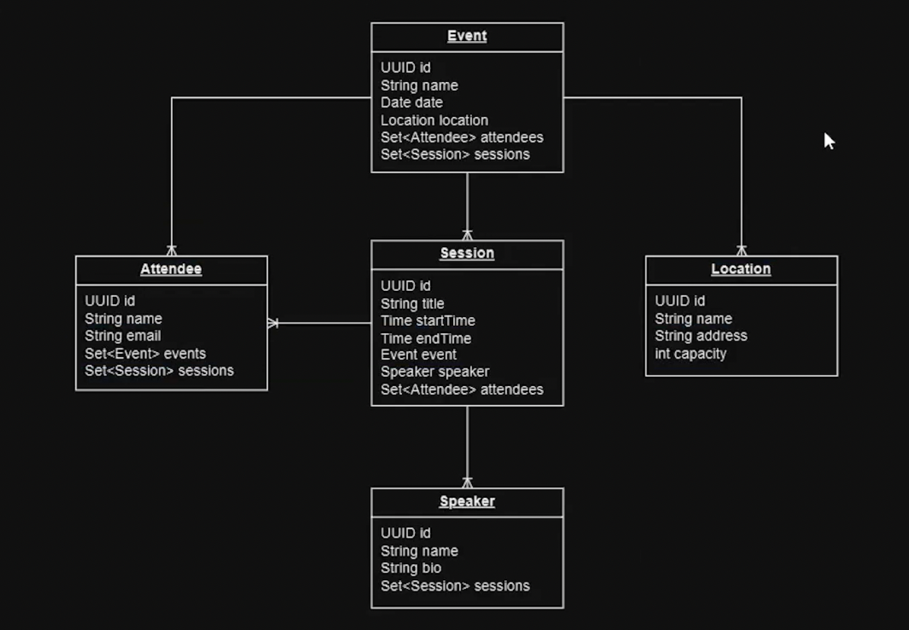

# EventTalks - Spring Boot Application

Este é um projeto Spring Boot que utiliza MySQL como banco de dados.

## Modelo Relacional



### Estrutura do Banco de Dados

O sistema é composto pelas seguintes entidades e seus relacionamentos:

- **Event (Evento)**
  - Representa um evento principal
  - Contém informações como nome, data, descrição
  - Possui várias sessões (Sessions)
  - Está vinculado a uma localização (Location)

- **Session (Sessão)**
  - Representa uma palestra ou atividade específica dentro do evento
  - Possui título, horário de início e fim
  - Está vinculada a um Speaker (palestrante)
  - Pode ter vários participantes (Attendees)

- **Speaker (Palestrante)**
  - Contém informações do palestrante
  - Nome, bio, área de expertise
  - Pode ministrar várias sessões

- **Attendee (Participante)**
  - Representa os participantes do evento
  - Contém dados pessoais como nome e email
  - Pode participar de várias sessões

- **Location (Local)**
  - Representa o local onde o evento acontece
  - Contém endereço e capacidade
  - Pode hospedar vários eventos

### Relacionamentos

- Event (1) -> (N) Session: Um evento possui várias sessões
- Event (N) -> (1) Location: Um evento acontece em um local
- Session (N) -> (1) Speaker: Uma sessão tem um palestrante
- Session (N) <-> (N) Attendee: Uma sessão tem vários participantes e um participante pode participar de várias sessões

## Configuração do Ambiente

### Pré-requisitos
- Docker instalado
- Java 17 ou superior
- Maven

### Configuração do MySQL com Docker

Para iniciar o banco de dados MySQL, execute o seguinte comando no terminal:

```bash
docker run --name mysql_eventalks -p 3306:3306 -e MYSQL_ROOT_PASSWORD=123456 -d mysql
```

Este comando irá:
- Criar um container chamado `mysql_eventalks`
- Mapear a porta 3306 do container para a porta 3306 do host
- Definir a senha do root como "123456"
- Executar o MySQL em modo daemon (background)

### Verificando o status do container

Para verificar se o container está rodando:
```bash
docker ps
```

### Parando o container

Para parar o container:
```bash
docker stop mysql_eventalks
```

### Iniciando o container novamente

Para iniciar um container que já existe:
```bash
docker start mysql_eventalks
```

## Implementação do CRUD

O projeto implementa operações CRUD (Create, Read, Update, Delete) para todas as entidades utilizando Spring Data JPA Repositories.

### Repositories

Para cada entidade, será criado um repository que estende JpaRepository, permitindo:

- **Create**: Inserção de novos registros
- **Read**: Consulta de registros existentes
- **Update**: Atualização de registros
- **Delete**: Remoção de registros

Serão implementados os seguintes repositories:

- **EventRepository**: Gerenciamento de eventos
  - Busca de eventos por data
  - Busca de eventos por localização
  - Listagem de eventos futuros

- **SessionRepository**: Gerenciamento de sessões
  - Busca de sessões por evento
  - Busca de sessões por palestrante
  - Busca de sessões por período

- **SpeakerRepository**: Gerenciamento de palestrantes
  - Busca de palestrantes por área de expertise
  - Busca de palestrantes por evento

- **AttendeeRepository**: Gerenciamento de participantes
  - Busca de participantes por sessão
  - Busca de participantes por evento
  - Gerenciamento de inscrições

- **LocationRepository**: Gerenciamento de locais
  - Busca de locais por capacidade
  - Verificação de disponibilidade

Cada repository terá métodos personalizados para atender às necessidades específicas do negócio, além dos métodos padrão fornecidos pelo JpaRepository.
